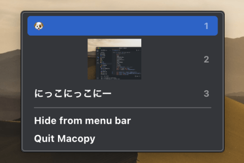
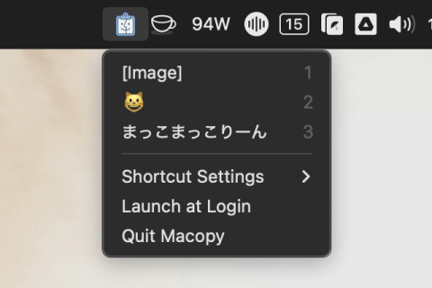

#  Macopy

> A minimal clipboard history tool for macOS — inspired by Clipy, optimized for speed and simplicity.

---

**Macopy** is a fast, lightweight clipboard manager built specifically for macOS. Inspired by the simplicity of Clipy, Macopy strips away complexity to deliver just what you need:

- 📋 Capture recent clipboard items (text and images)
- ⚡️ Paste instantly with a global shortcut
- 🧠 Detect the active application and simulate paste automatically
- 🧭 Access history and settings from the tray
- 💾 Remembers window size and settings across sessions

---

## 🚀 Features

| Feature                | Description                                        |
| ---------------------- | -------------------------------------------------- |
| 📋 Clipboard History   | Tracks latest 10 items (text or image)             |
| 🖼 Image Paste Support | Copy and reuse image items easily                  |
| 🧠 App Detection       | AppleScript-based active app tracking              |
| ⚡️ Global Shortcut    | Quickly toggle the popup with a hotkey             |
| 🧲 Paste Automation    | Automatically simulates ⌘+V into the frontmost app |
| 🧃 Tray Menu           | Access recent items, settings, and quit from tray  |
| 🛠 Persistent Settings | Shortcut, tray visibility saved locally            |

---

## 🛠 Installation

[⬇ Download the latest release](https://github.com/piro0919/macopy/releases/latest)

Or build locally:

```bash
git clone https://github.com/piro0919/macopy
cd macopy
npm install
npm run build
```

> On first run, macOS will ask for **Accessibility** and optionally **Screen Recording** permissions. These are required for paste automation and app detection.

---

## 📸 Preview

<table align="center">
  <tr>
    <td></td>
    <td></td>
  </tr>
</table>

---

## 🔐 Permissions Required (macOS)

To enable full functionality, please grant the following:

- **System Settings > Privacy & Security > Accessibility**  
  Allow Macopy to control your system for paste automation.

- **System Settings > Privacy & Security > Screen Recording** _(optional)_  
  Required on some macOS versions for detecting frontmost app.

---

## ⚙️ Development

Tauri builds the native side, so a Rust toolchain is needed alongside Node.

```bash
npm install
npm run dev     # tauri dev
npm run build   # tauri build, then an ad-hoc codesign of the .app
```

The landing page under `lp/` runs separately with `npm run dev:lp`.

## 📝 License

MIT — Contributions welcome!

---

## 🙌 Credits

Built with ❤️ using [Tauri](https://tauri.app/), [React](https://react.dev/), [TypeScript](https://www.typescriptlang.org/), and AppleScript integration.
Heavily inspired by [Clipy](https://github.com/Clipy/Clipy) — thank you!
